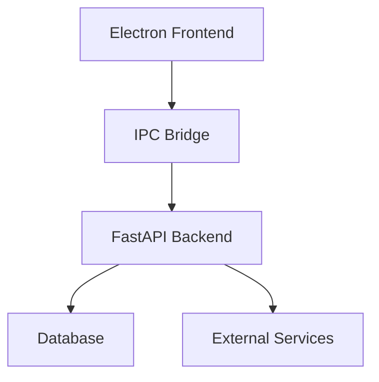

# Unified API Approach

## Overview
This document outlines the strategy for unifying the API layer between Electron and FastAPI in the Ontario Driving School Manager application.

## Architecture

### System Components


### API Layers
1. **Frontend Layer**
   - React components
   - State management
   - UI logic
   - Client-side validation

2. **IPC Bridge Layer**
   - Message handling
   - Data transformation
   - Error handling
   - Security checks

3. **Backend Layer**
   - Business logic
   - Data validation
   - Database operations
   - External integrations

## Implementation

### IPC Bridge
```typescript
// IPC Channel Types
interface IpcChannel {
  name: string;
  handler: (event: IpcMainEvent, ...args: any[]) => void;
}

// API Client
class ApiClient {
  async request<T>(channel: string, data: any): Promise<T> {
    return ipcRenderer.invoke(channel, data);
  }
}
```

### FastAPI Endpoints
```python
# API Router
@router.post("/students")
async def create_student(student: StudentCreate):
    return await student_service.create(student)

# Service Layer
class StudentService:
    async def create(self, student: StudentCreate) -> Student:
        return await self.repository.create(student)
```

## Security

### Authentication
- JWT token management
- Session handling
- Role-based access
- Permission checks

### Data Protection
- Input validation
- Output sanitization
- Error handling
- Audit logging

## Performance

### Optimization
- Request batching
- Response caching
- Connection pooling
- Query optimization

### Monitoring
- Performance metrics
- Error tracking
- Usage statistics
- Health checks

## Error Handling

### Types
- Validation errors
- Business logic errors
- System errors
- Network errors

### Handling
- Error mapping
- Logging
- User feedback
- Recovery procedures

## Data Flow

### Request Flow
1. Frontend request
2. IPC bridge
3. Backend processing
4. Database operation
5. Response handling

### Response Flow
1. Database result
2. Backend processing
3. IPC bridge
4. Frontend update

## Testing

### Unit Tests
- API endpoints
- Business logic
- Data validation
- Error handling

### Integration Tests
- IPC communication
- Database operations
- External services
- End-to-end flows

## Documentation

### API Documentation
- Endpoint descriptions
- Request/response formats
- Error codes
- Examples

### Code Documentation
- Function documentation
- Type definitions
- Architecture diagrams
- Flow charts

## Deployment

### Development
- Local setup
- Development server
- Hot reloading
- Debug tools

### Production
- Build process
- Deployment steps
- Monitoring setup
- Backup procedures

## Maintenance

### Updates
- Version control
- Dependency updates
- Security patches
- Feature additions

### Monitoring
- Performance tracking
- Error monitoring
- Usage analytics
- Health checks

## Future Considerations

### Scalability
- Microservices
- Load balancing
- Caching strategies
- Database sharding

### Features
- Real-time updates
- Offline support
- Batch operations
- Advanced analytics 