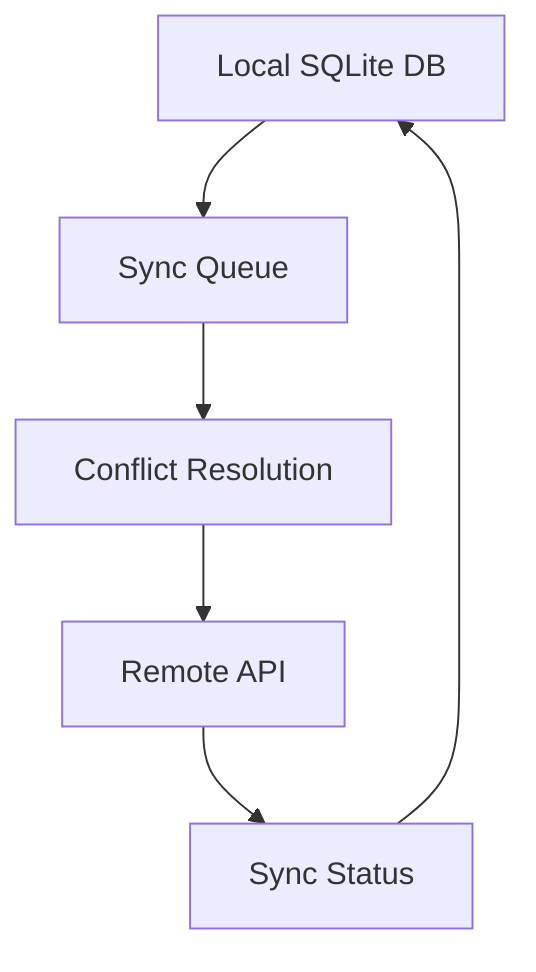

# Electron Offline Sync Proof of Concept

## Overview
This document outlines the proof of concept for implementing offline synchronization in our Electron-based driving school management application.

## Goals
- Enable full application functionality without internet connection
- Implement reliable data synchronization when connection is restored
- Ensure data consistency across multiple devices
- Handle conflicts gracefully

## Technical Approach

### 1. Local Storage Strategy
- Use SQLite for local data storage
- Implement IndexedDB for caching web resources
- Store sync metadata in local storage

### 2. Sync Architecture


### 3. Implementation Details

#### Data Models
```typescript
interface SyncMetadata {
    lastSyncTimestamp: number;
    deviceId: string;
    version: number;
    pendingChanges: Change[];
}

interface Change {
    id: string;
    entityType: string;
    entityId: string;
    operation: 'CREATE' | 'UPDATE' | 'DELETE';
    timestamp: number;
    data: any;
}
```

#### Sync Process
1. Track all local changes in sync queue
2. Batch changes for efficient sync
3. Implement retry mechanism with exponential backoff
4. Handle partial sync failures

### 4. Testing Strategy
- Simulate various network conditions
- Test conflict scenarios
- Verify data integrity
- Measure sync performance

## Risks and Mitigations

### Risks
1. Data conflicts during sync
2. Storage limitations
3. Sync performance issues
4. Battery impact

### Mitigations
1. Implement version-based conflict resolution
2. Use efficient storage strategies
3. Optimize sync frequency
4. Implement background sync

## Success Criteria
- Application works offline for 24+ hours
- Sync completes within 5 minutes
- No data loss during sync
- Battery impact < 5%

## Timeline
- Week 1: Basic offline functionality
- Week 2: Sync implementation
- Week 3: Testing and optimization

## Next Steps
1. Set up local SQLite database
2. Implement change tracking
3. Create sync queue
4. Develop conflict resolution
5. Build sync UI 