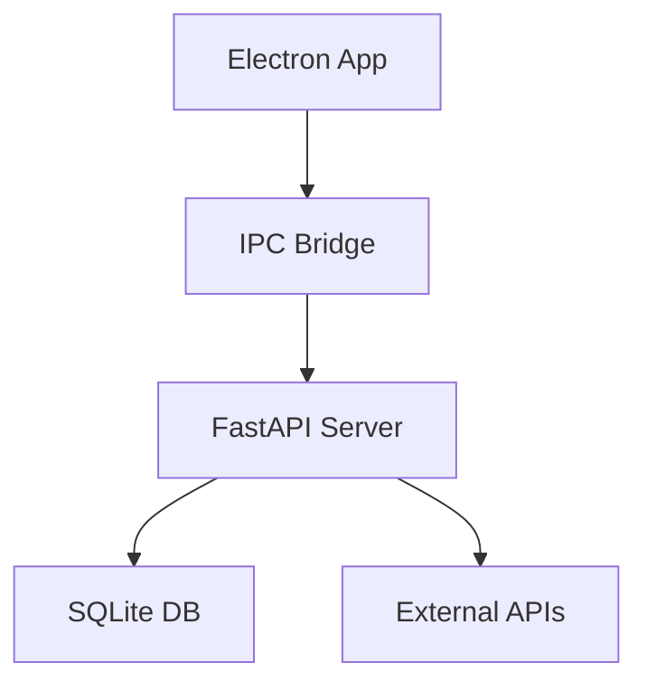

# Unified API Architecture

## Overview
This document outlines the architecture for integrating Electron with FastAPI to create a unified API layer for the driving school management system.

## Architecture Design

### 1. System Components


### 2. API Structure
```typescript
interface APIConfig {
    host: string;
    port: number;
    protocol: 'http' | 'https';
    auth: {
        type: 'jwt' | 'basic';
        config: any;
    };
    cors: {
        origins: string[];
        methods: string[];
    };
}
```

## Implementation Details

### 1. Electron Integration
```typescript
interface ElectronBridge {
    startServer: () => Promise<void>;
    stopServer: () => Promise<void>;
    send: (channel: string, data: any) => Promise<any>;
    receive: (channel: string, callback: Function) => void;
}
```

### 2. FastAPI Server
```python
from fastapi import FastAPI, HTTPException
from pydantic import BaseModel

app = FastAPI()

class APIResponse(BaseModel):
    status: str
    data: dict
    error: str = None

@app.get("/api/health")
async def health_check():
    return APIResponse(status="ok", data={"version": "1.0.0"})
```

### 3. IPC Communication
```typescript
interface IPCChannel {
    name: string;
    handler: (data: any) => Promise<any>;
    validator: (data: any) => boolean;
}
```

## Security Considerations

### 1. Authentication
- JWT tokens
- Session management
- Role-based access
- API keys

### 2. Data Protection
- Encryption at rest
- Secure communication
- Input validation
- Output sanitization

### 3. Access Control
```typescript
interface SecurityConfig {
    jwt: {
        secret: string;
        expiresIn: string;
    };
    cors: {
        allowedOrigins: string[];
        allowedMethods: string[];
    };
    rateLimit: {
        window: number;
        max: number;
    };
}
```

## Performance Optimization

### 1. Caching Strategy
- In-memory cache
- Disk cache
- Cache invalidation
- Cache warming

### 2. Request Handling
- Request batching
- Response compression
- Connection pooling
- Load balancing

### 3. Resource Management
```typescript
interface ResourceConfig {
    maxConnections: number;
    timeout: number;
    retryAttempts: number;
    backoffStrategy: string;
}
```

## Error Handling

### 1. Error Types
- Network errors
- Validation errors
- Business logic errors
- System errors

### 2. Error Response
```typescript
interface ErrorResponse {
    code: string;
    message: string;
    details?: any;
    timestamp: number;
}
```

### 3. Recovery Strategies
- Automatic retry
- Fallback options
- Circuit breaking
- Graceful degradation

## Monitoring and Logging

### 1. Metrics
- Response times
- Error rates
- Resource usage
- API usage

### 2. Logging
```typescript
interface LogConfig {
    level: 'debug' | 'info' | 'warn' | 'error';
    format: string;
    destination: string;
    rotation: {
        size: number;
        interval: string;
    };
}
```

## Success Criteria
- < 100ms API response time
- 99.9% uptime
- Zero data loss
- < 0.1% error rate

## Timeline
- Week 1: Architecture design
- Week 2: Implementation
- Week 3: Testing

## Next Steps
1. Set up FastAPI server
2. Implement IPC bridge
3. Create API endpoints
4. Add security measures
5. Deploy monitoring 